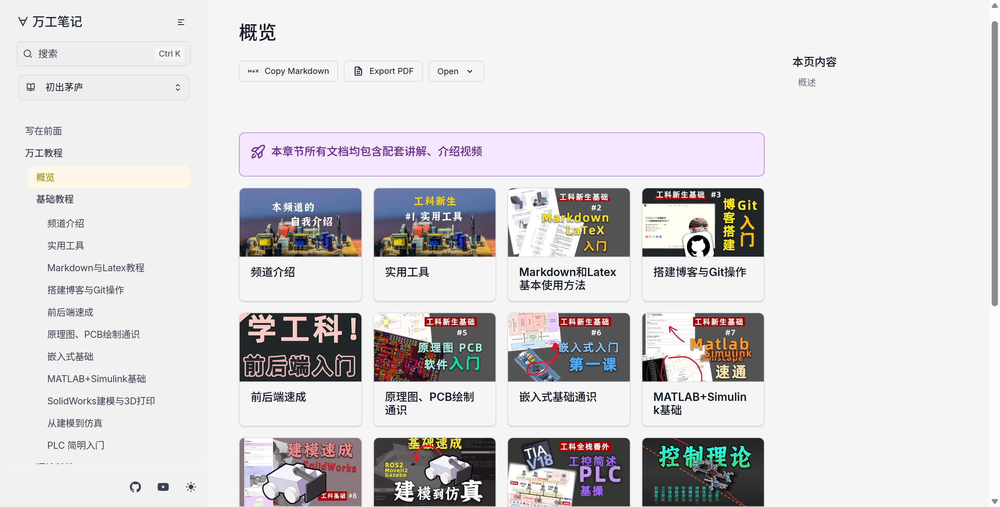

<div align=center>

</div>

# 欢迎来到 万工教程

## 这是什么？

本项目是为工科生们准备的**开源**入门教程文档+视频网站，包含：
- 各类工科技术的入门，前后端、嵌入式、建模、仿真等等
- 机器人前沿技术
- ……（持续更新中）

⭐ v2.0对网站布局整体结构进行了更新以获得更舒适的阅读体验。

## 快速部署

由于本网站目前依托于Vercel的SSR（Service Side Render）服务，所以需要翻墙才能访问，且对网络要求较高。以下提供本地部署的方案，只是无法进行评论。

首先你需要下载或git clone这个仓库。
```
git clone https://github.com/maindraster/starlight-blog
```
然后进入到根目录文件夹下，执行
```
pnpm i
```
再执行以下命令，你就可以在 http://localhost:4321/ 当中查看了。
```
pnpm dev
```
